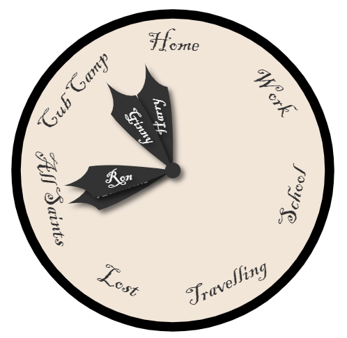

# WizardClock
A wizarding/location "clock" Lovelace component for Home Assistant



## About

I was suprised when I couldn't find something like this that somebody else had already made, so decided to give it a go myself! It took a few months due to not having much spare time, and javascript not being my first language, but I eventually got it working quite nicely for my purposes. It looks (and is) pretty basic so far.

I decided to make it public so that other (more skillful) people could make use of it and tweak it to improve it/make it look nicer - if you do use it and make any improvements please let me know so that I can incorporate them into my code!


## Features

* Shows the friendly name of the current Zone that a person/entity is located in 
* If a person/entity isn't in a Zone then it marks that entity as "Lost" (can be customised)
* If an entity has a velocity of greater than 15 then it marks that entity as "Travelling" (only tested using owntracks - and GPS must be turned on on your phone for velocity to be reported)
* Locations are added dynamically as needed, however you can configure permanently shown locations by adding them to the "locations" list in the config
* For family members without a phone (or those that don't want to be tracked with owntracks!) it can use the google calendar platform - simply create a calendar with the expected locations of that person as the name of appointments at the appropriate times
* Font face can be customised (I use "Blackadder" for a suitably wizardy look)
* Hand colour (and text colour on the hands) can be customised for each person
* Hands animate fairly smoothly between states
* "Lost" and "Travelling" state text can be customised
* Supports right-to-left (RTL) languages like Hebrew and other RTL languages


## Installation

### HACS

Use this repository as a custom repository in HACS.

### Manual

1. Copy wizard-clock-card.js to www/custom-lovelace/ in your home assistant folder, along with any particular font you want to use.
2. Go to Settings -> Dashboards, then hit the three dots to open the custom Resources editor.
3. Select "JavaScript Module" as the resource type, then add the URL "/local/custom-lovelace/wizard-clock-card.js?v=1" (note if you put the javascript file somewhere other than www/custom-lovelace/ you'll need to modify this accordingly).
5. Hit save.
6. Edit the dashboard you want to add it to, then add a "Manual" card. 
7. Add your config, see the example below


#### Updating

1. Copy the updated wizard-clock-card.js over the old version
2. Edit the url in the Resources editor to increment the version number, e.g:

  ```
  /local/custom-lovelace/wizard-clock-card.js?v=2
  ```
  

## Config

* locations (optional): a list of locations that are permanently visible, others are added/removed as required
* exclude (optional): a list of locations that shall never be displayed, wizards at those locations will default to the `lost` state
* wizards (required): a list of entities and display names for the device trackers/calendars used to represent your wizards. Now also supports setting individual colours for the hands/text.
* fontname (required): the name of the font you want to use in the clock
* fontface (optional): a fontface string to select a custom web-font to load
* shaft_colour (optional): the colour of the shaft
* lost (optional): text to display when an entity is lost, defaults to "Lost". 
* travelling (optional): text to display when an entity is travelling, defaults to "Travelling"
* width (optional): set the width (and therefore height, as it is always a circle) of the clock in pixels. Defaults to 500 if not set.

```
type: 'custom:wizard-clock-card'
locations:
  - Home
  - Work
  - School
wizards:
  - entity: device_tracker.harrys_phone
    name: Harry
    colour: '#F00'
    textcolour: '#00F'
  - entity: device_tracker.hermiones_phone
    name: Hermione
    colour: '#0F0'
  - entity: calendar.ron
    name: Ron
  - entity: calendar.ginny
    name: Ginny
fontname: itcblkad_font
fontface: >-
  font-family: itcblkad_font;    src: local(itcblkad_font),
  url('/local/custom-lovelace/ITCBLKAD.TTF') format('opentype');
width: 500
lost: 'In mortal peril'
travelling: 'Between here and there'
```


## Wishlist

These are features/ideas that I'd like to add at some point, but may not happen any time soon. Feel free to add them yourself and share your code if you're able!

* ~~Animations: Changes in status produce nicely animated transitions instead of just jumping about~~ Basic animations with ease-out now working, could do with ease-in too. Or possibly just going a bit mad and spinning round a couple of times before easing to the new location...
* Make pretty: It looks fairly basic at the moment (I'm no artist!).

  * ~~Maybe include support for themes too, if that's possible?~~ Colours are now taken from whatever theme you are using by default. Hand/text colour for each wizard can be overridden if desired... so it's getting there.
  * Add pictures on clock hands taken from people/entities or possibly zones? Or even a combination of both, so person x at location y has a special "person x at location y" picture.
  * Add config options for clock face colours, including the ability to make them transparent.
  
* Better support for "speed" attributes, including for person entities looking up the speed from their current device tracker source
* Better text rendering - this goes along with making it pretty, ~~perhaps include drawing the text in arcs around the outside of the clock~~, and handling longer location/wizard names better. Arc text now done, with code nicked from somebody else :)
* Pre-load custom web font before rendering - if this is even possible?
* ~~Make available through HACS~~

